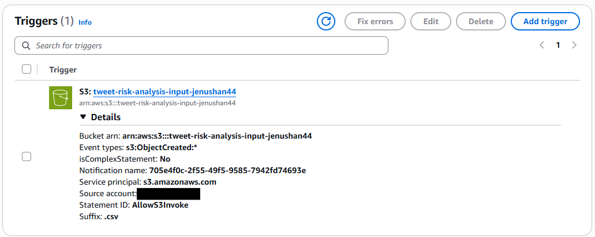

# Tweet Behavioral Risk Analysis

## Project Overview

Tweet Behavioral Risk Analysis is a Python project that uses AWS to analyze tweets and classify them based on signs of possible suicide-related risk.

A CSV file which contains tweets is uploaded to an S3 input bucket and this automatically starts an AWS Lambda function that processes the CSV and sends the tweets to Amazon Bedrock. Amazon Nova Micro classifies each tweet as high risk, potentially likely, neutral, or unlikely.

The results are added to the CSV and saved in a separate S3 output bucket.

## How It Works

The project follows this process:

```text
CSV Upload
    ↓
S3 Input Bucket
    ↓
AWS Lambda
    ↓
Amazon Bedrock
    ↓
Amazon Nova Micro
    ↓
S3 Output Bucket
```

When a CSV file is uploaded to the input S3 bucket, a trigger automatically starts the Lambda function. The event from the trigger gives Lambda information about the uploaded file, such as the bucket name and file name. Lambda uses this information to get the CSV from S3 and load it into a pandas DataFrame.

### S3 Trigger

The S3 trigger is set to start the Lambda function when a new `.csv` file is uploaded to the input bucket.



## AWS Services

| Service           | How I Used It                             |
| ----------------- | ----------------------------------------- |
| Amazon S3         | Stores the input and output CSV files     |
| AWS Lambda        | Runs the Python code                      |
| Amazon Bedrock    | Allows the program to access the AI model |
| Amazon Nova Micro | Classifies the tweets                     |
| Amazon CloudWatch | Shows Lambda logs and errors              |
| AWS IAM           | Handles permissions for the AWS services  |

I chose Nova Micro because the project only needs to classify text into four categories, so I did not need a larger AI model.

## Input and Processing

The input CSV needs to have a `Tweet` column so the program first checks that the CSV is not empty and that the `Tweet` column exists. It then randomly selects 100 tweets without replacement and sends each selected tweet to Nova Micro for classification.

## Tweet Classification

Nova Micro classifies each tweet into one of four categories:
- high risk - clearly shows suicidal thoughts, intent to die, or self-harm
- potentially likely - shows possible suicidal thinking or serious negative feelings
- neutral - may mention negative feelings or difficult situations but does not show enough signs of suicide-related risk
- unlikely - does not show signs of suicide-related risk

The model is told to only use the text in the tweet when making its decision and the response from the model is also cleaned by making it lowercase and removing any extra spaces and punctuation. This helps make sure that the responses such as `Neutral.` can still be seen as `neutral`.

## Output

The program adds two new columns to the CSV:
- `suicide_likelihood` - stores the classification from Nova Micro
- `alert_of_risk` - stores either `1` or `0`

The alert values are:

| Classification     | alert_of_risk |
| ------------------ | ------------- |
| high risk          | 1             |
| potentially likely | 1             |
| neutral            | 0             |
| unlikely           | 0             |

The finished file is saved as `results.csv` in the output S3 bucket.

## Rate Limiting

The project has a limit of 10 Bedrock requests per second and it waits 0.1 seconds before each request:

```python
time.sleep(0.1)
```

This helps keep the requests in the required limit.

## Error Handling

If a Bedrock request fails, the program can try the request up to three times. After a failed request, it waits before trying again. The wait gets longer after each failed attempt and also includes a small random delay. If all three attempts fail, the program returns `None` for that tweet instead of stopping the entire program. The program also checks that the response from Nova Micro is one of the four expected classifications.

## Challenges

### Implementing Exponential Backoff

One challenge I had was figuring out how long the program should wait after a Bedrock request failed. At first, I thought about using the same wait time after every failed request, but I learned about exponential backoff. With exponential backoff, the wait time increases after each failed attempt. I used this so that the program would not keep sending requests to Bedrock right away if the service was having a temporary issue. I also added jitter, which adds a small random amount of time to the delay and this helps to spread out the retries instead of having requests retry at the exact same time.

```python
wait_time = (2 ** attempt) + random.uniform(0, 1)
```

### Handling Inconsistent Model Output

Another challenge was handling the unexpected responses from Nova Micro. Even though the prompt tells the model to only return one of the four classifications, sometimes the response could have different capitalization, extra spaces, or punctuation. To handle this, I converted the response to lowercase and removed extra spaces and punctuation. I also checked that the result matched one of the four allowed classifications before using it. If the response still does not match one of the expected values, the program returns `None` instead of using an incorrect classification.

## Testing

I tested the project by uploading CSV files to the input S3 bucket and checking the results.

I checked that:

- Uploading a CSV starts the Lambda function
- Lambda can get the CSV from S3
- Invalid CSV files are caught
- 100 tweets are randomly selected without replacement
- Tweets are classified by Nova Micro
- The classification and alert columns are added
- `results.csv` is saved in the output S3 bucket
- Errors and logs can be viewed in CloudWatch

## Tech Stack

- Python
- pandas
- boto3
- Amazon S3
- AWS Lambda
- Amazon Bedrock
- Amazon Nova Micro
- Amazon CloudWatch
- AWS IAM
