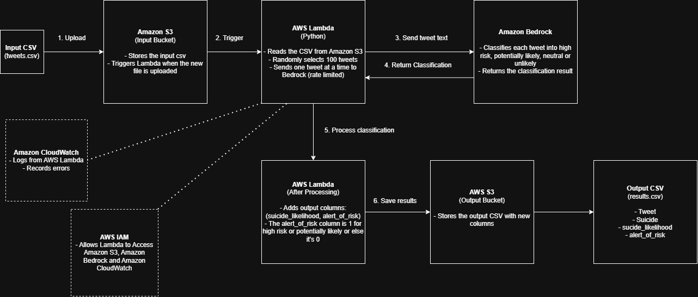

# Tweet Behavioral Risk Analysis - Architecture Design

## Project Overview

The goal of this project is to build a python application that classifies tweets based on possible suicide-related risk using Amazon Bedrock. The program will read a CSV file, randomly choose tweets from the dataset, send each tweet to Amazon Bedrock, create the required output columns, and save the completed results.

The required output columns are:
- `suicide_likelihood`
- `alert_of_risk`

The `Suicide` column in the dataset will not be used during the classification because it already has the original label.

# Dataset

The dataset contains two columns whcih are tweet and sucide. The application will only send the `Tweet` column to Amazon Bedrock.

Before processing begins, the program will check that:
- the input file is a CSV
- the Tweet column exists
- the file is not empty

# AWS Services

I plan to use these AWS services because they meet the assignment requirements and also keep the project simple:
- Amazon S3: Store the input and output CSV files 
- AWS Lambda: Run the Python program 
- Amazon Bedrock: Classify each tweet 
- Amazon CloudWatch: View logs and errors 
- AWS IAM: Manage permissions between AWS services 

# Architecture Diagram



# System Flow

```
CSV File -> Amazon S3 -> AWS Lambda -> Amazon Bedrock -> Processed Results -> Amazon S3
```

The CSV file will be uploaded to Amazon S3 and uploading the file will start the Lambda function. Lambda will read the CSV file, send tweets to Amazon Bedrock for classification, create the required output columns, and save the completed CSV back to Amazon S3. CloudWatch will be used to view logs if any errors happen during processing.

# Processing Steps

The application will:

1. Read the CSV file.
2. Check that the Tweet column exists.
3. Randomly choose at least 100 tweets without replacement.
4. Send each selected tweet to Amazon Bedrock.
5. Create the required output columns.
6. Save the completed CSV file.

If the input file contains less than 100 tweets, then all of the available tweets would be processed. The application will also make sure that no more than 10 tweets are processed every second.

# Rate Limiting

The program will process one tweet at a time. After each tweet is sent to Amazon Bedrock, it will wait 0.1 seconds before sending the next one. This keeps the program at a maximum of 10 tweets per second, which follows the assignment requirements.

# Error Handling

If something goes wrong while processing a tweet, the application will retry the request a few times. If the request still fails, the error will be logged and the program will continue processing the remaining tweets instead of stopping the entire program. CloudWatch will be used to help find any errors during testing.

# Limitations

Some limitations of this are that:

- The model may not always classify tweets correctly.
- A single tweet may not provide enough information.
- Different language models may return different results.
- The output should not be treated as a medical diagnosis.

# Summary

This project will use python together with Amazon S3, AWS Lambda, Amazon Bedrock, CloudWatch, and IAM to build a tweet classification system. The program will read tweets from a CSV file, classify them using Amazon Bedrock, create the required output columns, and save the completed results back to Amazon S3 while following the assignment requirements.